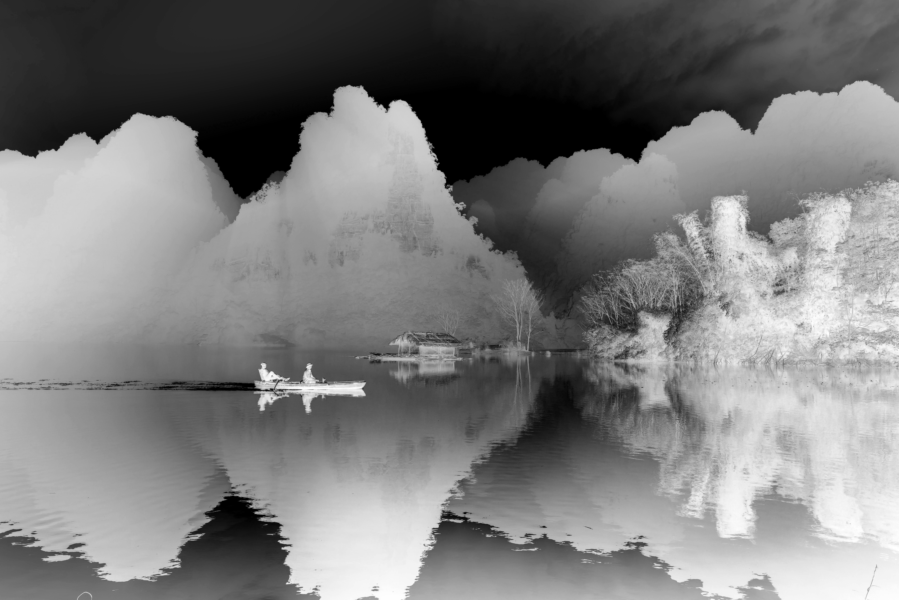
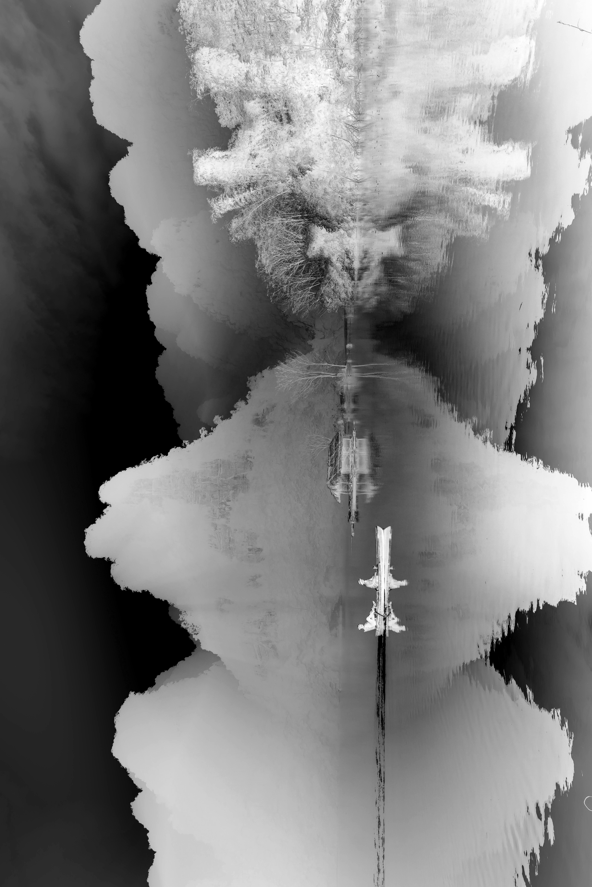
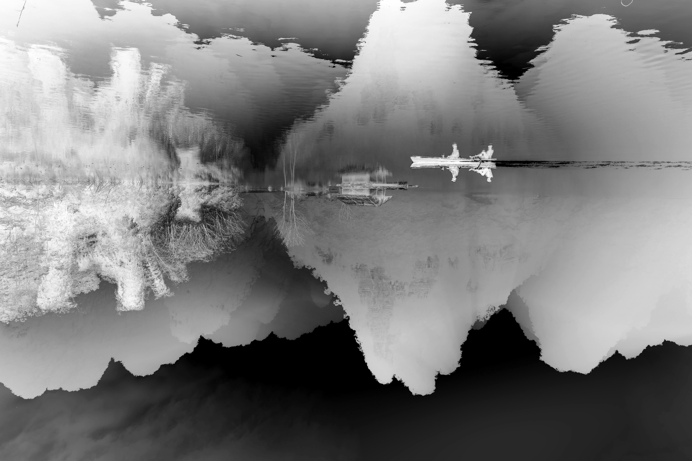

# 🖼️ Image Processing with NumPy and Matplotlib

This project demonstrates fundamental image processing operations implemented **without OpenCV**, using only **NumPy** and **Matplotlib**. It explores pixel-level manipulations such as grayscale conversion, image negation, rotation, cropping, and histogram equalization.

---

## 📦 Requirements

Make sure you have Python and the following libraries installed:

```bash
pip install numpy matplotlib

--- 

## 📌 Features

✅ Load and display image  
✅ Grayscale conversion using pixel intensity formula  
✅ Negative image generation  
✅ Image rotation (90°, 180°, 270°) using `np.rot90()`  
✅ Cropping using NumPy slicing  

---

## 📂 Folder Structure

image_processing_numpy/
├── images/
│ └── input_image.jpg 
├── results/
│ ├── Gray_image.jpg
│ ├── negative_image.jpg
│ ├── rotated_image.jpg
│ ├── rotated_image_180.jpg
│ ├── rotated_image_270.jpg
│ ├── equalized_image.jpg
├── main.py 
├── README.md 

---

## 🛠️ How to Run
If you want to try with your own image follow the instructions clone the repo first then follow the instructions:
1. Place your image inside the `images/` folder and rename it as `input_image.jpg`
2. Run the script:

```bash
python main.py

---

## sample output
 




---